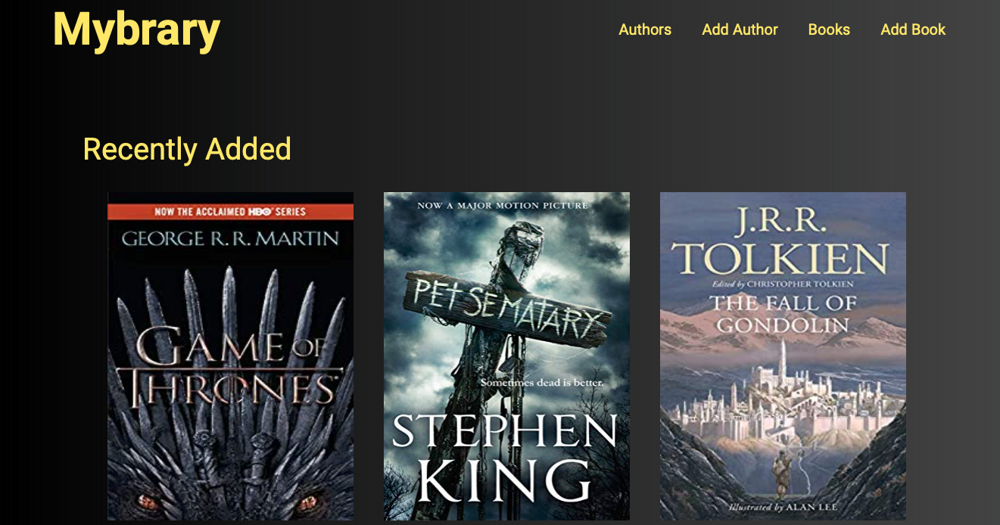

<h1 align="center">Mybrary - Node JS</h1>

 

   <a href="#-technologies">Technologies</a>&nbsp;&nbsp;&nbsp;|&nbsp;&nbsp;&nbsp;
   <a href="#-project">Project</a>&nbsp;&nbsp;&nbsp;&nbsp;&nbsp;&nbsp;
 

 

    
 

 ## :rocket: Technologies

 Personal library application for listing all the books that you have already read, all the following were used to developed it:

 - [NodeJS](https://nodejs.org/en/)
 - [Handlebars](https://handlebarsjs.com)
 - [Express](https://expressjs.com)
 - [Filepond](https://pqina.nl/filepond/)
 - [Mongoose](https://mongoosejs.com)

 ## 💻 Project

Wanna see a live version ? Check it out: [Mybrary App](https://nodelibraryjs.herokuapp.com).

 ---
<h4 align="center">
   Code and coffee ☕
</h4>
